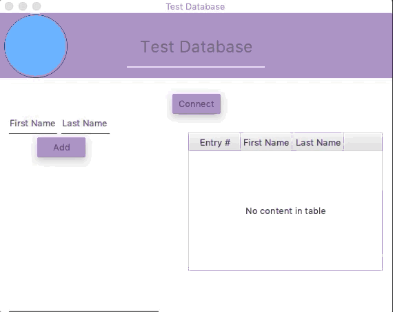

# GuiDatabase
This is a short program that uses a Derby Embedded Batabase made with Apache as well as a GUI made with Gluon SceneBuilder.
Its only function at the moment is to connect to a database at the click of a button and to return wether or not the connection
was successful. Future functions will be to view the database as well as add and delete entries into it. It contains TextFields, TextArea, TableView, Label, Button, AnchorPane, GridPane, Seprator, a Circle, and a visual element from the JFoenix library that shows a ripple effect when a button is clicked. 

## GUI Design Principles
I tried to make the GUI aesthetically pleasing by using simple colors and shapes. All elements in the GUI are aligned ith eachother and with the border of the pane. The design should make functionality clear as well as being graphically clear as easy to read fonts and font colors were used and all fonts were a readable size and not too small. Being made in Java, the program can run on virtually any platform as long as the the JVM is present. Output from the program is also consitent across platforms and over multiple uses. Overall the GUI was desinged simply making it easier to use, making it more efficient, direct, and predictable.

## Demonstration

## Diagrams
In the future when this program is fully functional, a database diagram will be added here.

## Getting Started
To run this program, simply download the folder and opne in idea of your choice. Configure to run through Main.java and click run.

## Built With
* IntelliJ IDEA
* JavaFX
* SceneBuilder
* JFoenix Library

## Author
* Harrison Paxton

## License
MIT License

Copyright (c) 2018 harrisonp18

Permission is hereby granted, free of charge, to any person obtaining a copy of this software and associated documentation files (the "Software"), to deal in the Software without restriction, including without limitation the rights to use, copy, modify, merge, publish, distribute, sublicense, and/or sell copies of the Software, and to permit persons to whom the Software is furnished to do so, subject to the following conditions:

The above copyright notice and this permission notice shall be included in all copies or substantial portions of the Software.

THE SOFTWARE IS PROVIDED "AS IS", WITHOUT WARRANTY OF ANY KIND, EXPRESS OR IMPLIED, INCLUDING BUT NOT LIMITED TO THE WARRANTIES OF MERCHANTABILITY, FITNESS FOR A PARTICULAR PURPOSE AND NONINFRINGEMENT. IN NO EVENT SHALL THE AUTHORS OR COPYRIGHT HOLDERS BE LIABLE FOR ANY CLAIM, DAMAGES OR OTHER LIABILITY, WHETHER IN AN ACTION OF CONTRACT, TORT OR OTHERWISE, ARISING FROM, OUT OF OR IN CONNECTION WITH THE SOFTWARE OR THE USE OR OTHER DEALINGS IN THE SOFTWARE.

## Acknowledgements
* JFoenix

## History
* Originally submitted for in class GUI database assignment.

## Key Programming Concepts Utilized
* JDBC
* Apache Derby
